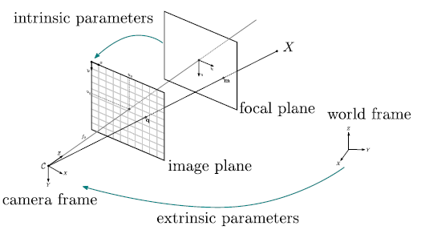
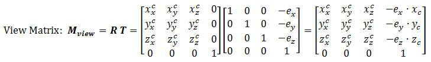

[Live demo](http://jeremybouny.fr/experiments/screen_space_grid/)

[Full source code](hhttps://github.com/jbouny/projected-grid/blob/master/js/shaders/ScreenSpaceShader.js)

## Problem

When rendering a large terrain, surface water or other elements, we have one problem: How to avoid too many vertices?

One common way to optimize the number of vertices, is to use a [level of detail (LOD)](http://www.wikiwand.com/en/Level_of_detail) implementation.


<p style="text-align:center;">

<br/>
[LOD implementation](http://openclassrooms.com/forum/sujet/nazara-dynaterrain-recherche-graphiste)
</p>


The surface is divided into a grid of patches. The resolution of each patch will be computed depending of the distance to the viewer.

This method has several pros and cons. Even if it allows a relatively constant resolution, it needs a pre processing and can cause a couple of artefacts between patches.

You can found a [full explanation here](http://habib.wikidot.com/projected-grid-ocean-shader-full-html-version#toc7).


## Projected grid?

Ideally, we want a uniform resolution in screen space, instead of working in 3d world for rendering object. This can be achieved with a simple way for rendering large elements fairly flat, as terrain (under some conditions) or water.

The concept is rather easy. We put a grid in screen space coordinates, and project each vertices on a plane in the 3d world.

With this principle, there is no heavy computation and no artefacts.


<p style="text-align:center;">

<br/>
[Illustration of a projected grid](http://habib.wikidot.com/projected-grid-ocean-shader-full-html-version#toc11)
</p>


### Examples & demo

[A demo here allows to play with this concept.](http://jeremybouny.fr/experiments/screen_space_grid/)

<p style="text-align:center;">
[](grid_zoom1.jpg)
[](grid_zoom2.jpg)
[](grid_zoom3.jpg)
[](grid_zoom4.jpg)
<br/>
Several zoom levels
</p>


We can see that the grid looks exactly the same on every zoom level. Only the depth change in order to project each vertices on the 3d plane.

<p style="text-align:center;">
[](grid_2.jpg)
[](grid_3.jpg)
<br/>
Rendering the grid with a black material / a water effect
</p>


<p style="text-align:center;">
[](grid_5.jpg)
<br/>
Close view on water rendering
</p>

## Implementation in GLSL / Three.js

In order to implement an efficient projected grid, we need only three things:

- create the grid
- put the grid in front of the camera
- compute the depth on each vertices


### Create the grid

It is the easiest step:
```
// Create a grid of size 1 * 1 and a resolution of 256 * 256
var gridGeometry = new THREE.PlaneBufferGeometry( 1, 1, 256, 256 );
```

### Put the grid in front of the camera

In OpenGL ES 2.0, an object need to be visible in order to be draw. If an object is not in the camera frustum, even the vertex shader is not applied. Our mesh need to be always visible by the camera.

One way to achieve it is to add the mesh on the camera.

```
// Create the mesh and add it on the camera
var gridMesh = new THREE.Mesh( gridGeometry, gridMaterial );
camera.add( gridMesh );
```

Here, we have a mesh always called on rendering. We want to really put it in front of the camera with a vertex shader, with a real screen space grid.

We will use the UV information in order to apply the grid on the screen. The grid UVs need to match the screen UVs.

We also need a way to get the aspect ratio. This information can be extracted from the projection matrix. UVs are in [0;1]. Here, we want the 3D coordinate in camera space.


<p style="text-align:center;">

<br/>
[Perspective projection in camera space](http://www.ntu.edu.sg/home/ehchua/programming/opengl/cg_basicstheory.html)
</p>


```
vec2 getImagePlan()
{
  // http://www.terathon.com/gdc07_lengyel.pdf
  // Extracting aspect and focal from projection matrix:
  // e = focal, h = height, w = width, P = projection matrix
  // P = | e   0       0   0 |
  //     | 0   e/(h/w) 0   0 |
  //     | 0   0       .   . |
  //     | 0   0       -1  0 |
  float focal = projectionMatrix[0].x;
  float focalY = projectionMatrix[1].y;

  // Fix coordinate aspect and scale
  return vec2( ( uv.x - 0.5 ) * focalY, ( uv.y - 0.5 ) * focal );
}

...

vec2 coordinates = getImagePlan();
vec3 point = vec3( coordinates.x, coordinates.y, projectionMatrix[0].x );
```

### Compute the depth on each vertices

To get the final depth, a ray tracing is necessary.

<p style="text-align:center;">

<br/>
[Pinhole model and spaces conversion](https://openmvg.readthedocs.org/en/latest/openMVG/cameras/cameras/)
</p>

The ray tracing means that we need to get the 3d ray for each pixel in world space. To get this 3d ray, we also need extrinsics parameters: 
- the rotation of the camera in the world
- the position of the camera in the world

We could set these data with uniform but there is an easier way: extract it from available matrices. The view matrix is composed of the rotation and the translation.


<p style="text-align:center;">

<br/>
[View matrix construction](http://www.ntu.edu.sg/home/ehchua/programming/opengl/cg_basicstheory.html)
</p>


The camera position and rotation can be retrieved with:


```
mat3 getRotation()
{
  // Extract the 3x3 rotation matrix from the 4x4 view matrix
  return mat3(
    viewMatrix[0].xyz,
    viewMatrix[1].xyz,
    viewMatrix[2].xyz
  );
}

vec3 getCameraPos( in mat3 rotation )
{
  // Xc = R * Xw + t
  // c = - R.t() * t <=> c = - t.t() * R
  return - viewMatrix[3].xyz * rotation;
}
```


Compute the 3d ray in world coordinates system in now easy.


```
vec3 getCamRay( in mat3 rotation, in vec2 screenUV )
{
  // Compute camera ray then rotate it in order to get it in world coordinate
  return vec3( screenUV.x, screenUV.y, projectionMatrix[0].x ) * rotation;
}

...

// Extract camera position and rotation from the view matrix
mat3 cameraRotation = getRotation();
vec3 camPosition = getCameraPos( cameraRotation );

// Extract coordinate of the vertex on the image plan
vec2 screenUV = getImagePlan();

// Compute the ray from camera to world
vec3 ray = getCamRay( cameraRotation, screenUV );
```

The last step consists in computing the intersection between the simulated object (here a plane) and the ray.


<p style="text-align:center;">

<br/>
[Ray-plane intersection](http://www.echo-gaming.eu/ray-to-plane-intersection/)
</p>


```
vec3 interceptPlane( in vec3 source, in vec3 dir, in vec3 normal, float height )
{
  // Compute the distance between the source and the surface, following a ray, then return the intersection
  // http://www.cs.rpi.edu/~cutler/classes/advancedgraphics/S09/lectures/11_ray_tracing.pdf
  float distance = ( - height - dot( normal, source ) ) / dot( normal, dir );
  if( distance < 0.0 )
    return source + dir * distance;
  else
    return - ( vec3( source.x, height, source.z ) + vec3( dir.x, height, dir.z ) * infinite );
}

...

// Compute the ray from camera to world
vec3 ray = getCamRay( cameraRotation, screenUV );

vec3 finalPos = interceptPlane( camPosition, ray, groundNormal, groundHeight );

float distance = length( finalPos );
if( distance > infinite )
  finalPos *= infinite / distance;
```

[Live demo](http://jeremybouny.fr/experiments/screen_space_grid/)

[Full source code](https://github.com/jbouny/projected-grid/blob/master/js/shaders/ScreenSpaceShader.js)


### Usage example

[Example](https://github.com/jbouny/projected-grid/blob/master/js/shaders/ScreenSpaceShader.js)


``` 
vertexShader: [
  'precision highp float;',
  
  'varying vec3 vWorldPosition;',
  'varying vec4 vReflectCoordinates;',

  'uniform mat4 u_mirrorMatrix;',
  
  THREE.ShaderChunk[ "screenplane_pars_vertex" ],
  THREE.ShaderChunk[ "oceanfft_pars_vertex" ],

  'void main (void) {',
    THREE.ShaderChunk[ "screenplane_vertex" ],
    
    'vec4 worldPosition = screenPlaneWorldPosition;',
    
    THREE.ShaderChunk[ "oceanfft_vertex" ],
    
    'vWorldPosition = oceanfftWorldPosition.xyz;',
    'vReflectCoordinates = u_mirrorMatrix * oceanfftWorldPosition;',
    
    'gl_Position = projectionMatrix * viewMatrix * oceanfftWorldPosition;',
  '}'
].join('\n'),
```

<p style="text-align:center;">
[](sunset_ocean_fft.jpg)
<br/>
[A trip under the moonlight](https://jbouny.github.io/fft-ocean/)
</p>

## Resources

- http://habib.wikidot.com/projected-grid-ocean-shader-full-html-version
- http://www.digitalrune.com/Support/Blog/tabid/719/EntryId/210/Water-Rendering.aspx
- http://fileadmin.cs.lth.se/graphics/theses/projects/projgrid/


