[Live demo](http://jeremybouny.fr/experiments/screen_space_grid/)

[Full source code](hhttps://github.com/jbouny/projected-grid/blob/master/js/shaders/ScreenSpaceShader.js)

## Problem

When rendering a large terrain, surface water or other elements, we have one problem: How to obtain a great quality when rendering but avoiding too many vertices?

One common way to optimize the number of vertices, is to use a [level of detail (LOD)](http://www.wikiwand.com/en/Level_of_detail) implementation.


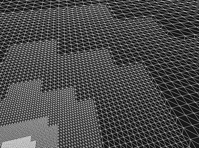
<p style="text-align:center;">
  [LOD implementation](http://openclassrooms.com/forum/sujet/nazara-dynaterrain-recherche-graphiste)
</p>


The surface is divided into a grid of patches. The resolution of each patch will be computed depending of the distance to the viewer.

This method has several pros and cons. Even if it allows a relatively constant resolution, it needs a pre-processing and can cause a couple of artifacts between patches.

You can found a [full explanation here](http://habib.wikidot.com/projected-grid-ocean-shader-full-html-version#toc7), [on wikipedia](http://www.wikiwand.com/en/Level_of_detail), or [test various implementations](http://vterrain.org/LOD/Implementations/).


## Projected grid?

Ideally, we want a uniform resolution in screen space, instead of working in 3d world for rendering object. This can be achieved with a simple way for rendering large elements fairly flat, as terrain (under some conditions) or water.

The concept is rather easy. We put a grid in screen space coordinates, and project each vertices on a plane in the 3d world ([more information here](http://habib.wikidot.com/projected-grid-ocean-shader-full-html-version#toc11))

With this principle, there is no heavy computation and no artifacts.


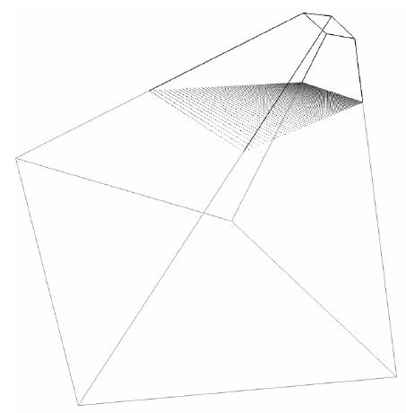
<p style="text-align:center;">
  [Illustration of a projected grid](http://habib.wikidot.com/projected-grid-ocean-shader-full-html-version#toc11)
</p>


### Examples & demo

[A demo here allows to play with this concept.](http://jeremybouny.fr/experiments/screen_space_grid/)


<div class="row">
  <a href="grid_zoom1.jpg">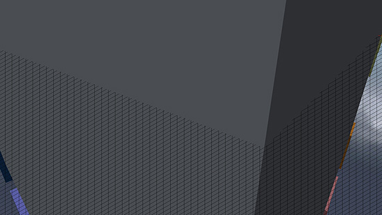</a>
  <a href="grid_zoom2.jpg">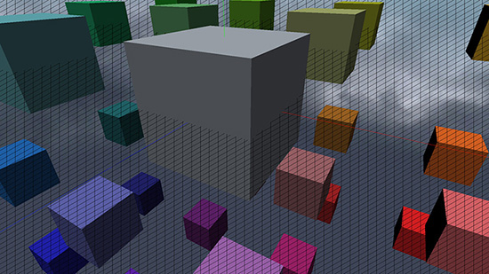</a>
</div>
<div class="row">
  <a href="grid_zoom3.jpg">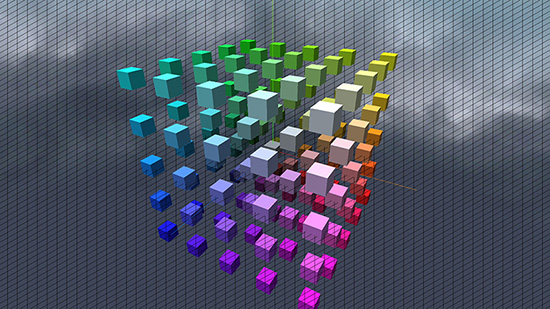</a>
  <a href="grid_zoom4.jpg">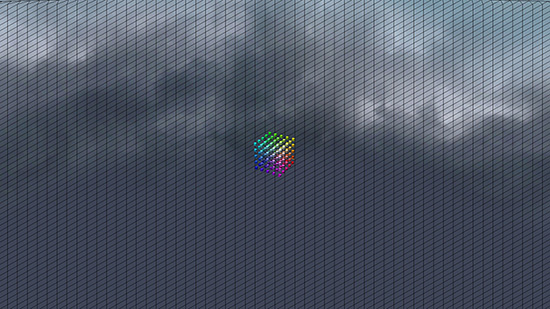</a>
</div>
<p style="text-align:center;">
  Several zoom levels with a grid of 64*64
</p>


We can see that the grid looks exactly the same on every zoom level. Only the depth change in order to project each vertices on the 3d plane.


<div class="row">
  <a href="grid_2.jpg">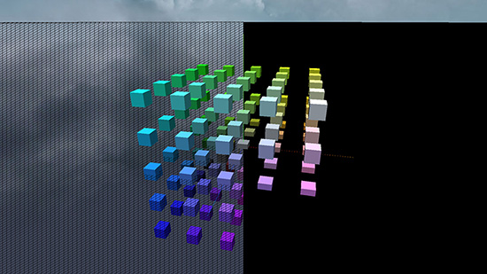</a>
  <a href="grid_3.jpg">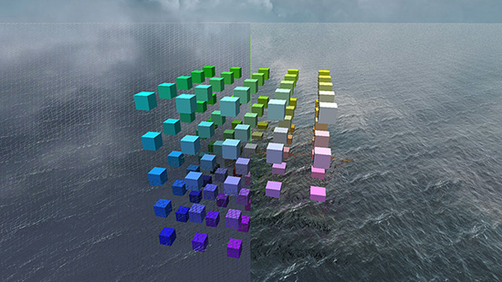</a>
</div>
<p style="text-align:center;">
  Rendering the grid of 128*128 with a black material / a water effect
</p>


<a href="grid_5.jpg">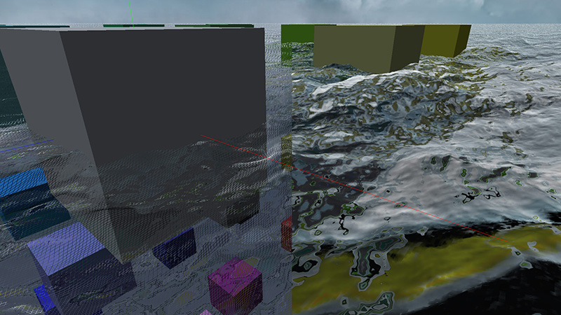</a>
<p style="text-align:center;">
  Close view on water rendering with a projected grid of 256*256
</p>


## Implementation in GLSL / Three.js

In order to implement an efficient projected grid, we need only three things:

- create the grid
- put the grid in front of the camera
- compute the depth on each vertices

Everything should be fully automated, with minimal CPU computing at each frame.

### Create the grid

It is the easiest step:
```
// Create a grid of size 1 * 1 and a resolution of 256 * 256
var gridGeometry = new THREE.PlaneBufferGeometry( 1, 1, 256, 256 );
```

### Put the grid in front of the camera

In OpenGL ES 2.0, an object need to be visible in order to be drawn. If an object is not in the camera frustum, even the vertex shader is not applied. Our mesh need to be always visible by the camera.

One way to achieve it is to add the mesh on the camera.

```
// Create the mesh and add it on the camera
var gridMesh = new THREE.Mesh( gridGeometry, gridMaterial );
camera.add( gridMesh );
```

Here, we have a mesh always called on rendering. We want to really put it in front of the camera with a vertex shader, with a real screen space grid.

We will use the UV information in order to apply the grid on the screen. The grid UVs need to match the screen UVs.

We also need a way to get the aspect ratio. This information can be extracted from the projection matrix. UVs are in [0;1]. Here, we want the 3D coordinate in camera space.


<p style="text-align:center;">
  [Perspective projection in camera space](http://www.ntu.edu.sg/home/ehchua/programming/opengl/cg_basicstheory.html)
</p>


```
vec2 getImagePlan()
{
  // http://www.terathon.com/gdc07_lengyel.pdf
  // Extracting aspect and focal from projection matrix:
  // e = focal, h = height, w = width, P = projection matrix
  // P = | e   0       0   0 |
  //     | 0   e/(h/w) 0   0 |
  //     | 0   0       .   . |
  //     | 0   0       -1  0 |
  float focal = projectionMatrix[0].x;
  float focalY = projectionMatrix[1].y;

  // Fix coordinate aspect and scale
  return vec2( ( uv.x - 0.5 ) * focalY, ( uv.y - 0.5 ) * focal );
}

...

vec2 coordinates = getImagePlan();
vec3 point = vec3( coordinates.x, coordinates.y, projectionMatrix[0].x );
```

### Compute the depth on each vertices

To get the final depth, a ray tracing is necessary.


<p style="text-align:center;">
  [Pinhole model and spaces conversion](https://openmvg.readthedocs.org/en/latest/openMVG/cameras/cameras/)
</p>


The ray tracing means that we need to get the 3d ray for each pixel in world space. To get this 3d ray, we also need extrinsics parameters: 
- the rotation of the camera in the world
- the position of the camera in the world

We could set these data with a uniform, but there is an easier way: extract it from available matrices. The view matrix is composed of the rotation and the translation.


<p style="text-align:center;">
  [View matrix construction](http://www.ntu.edu.sg/home/ehchua/programming/opengl/cg_basicstheory.html)
</p>


The camera position and rotation can be retrieved with:


```
mat3 getRotation()
{
  // Extract the 3x3 rotation matrix from the 4x4 view matrix
  return mat3(
    viewMatrix[0].xyz,
    viewMatrix[1].xyz,
    viewMatrix[2].xyz
  );
}

vec3 getCameraPos( in mat3 rotation )
{
  // Xc = R * Xw + t
  // c = - R.t() * t <=> c = - t.t() * R
  return - viewMatrix[3].xyz * rotation;
}
```


Compute the 3d ray in world coordinates system in now easy.


```
vec3 getCamRay( in mat3 rotation, in vec2 screenUV )
{
  // Compute camera ray then rotate it in order to get it in world coordinate
  return vec3( screenUV.x, screenUV.y, projectionMatrix[0].x ) * rotation;
}

...

// Extract camera position and rotation from the view matrix
mat3 cameraRotation = getRotation();
vec3 camPosition = getCameraPos( cameraRotation );

// Extract coordinate of the vertex on the image plan
vec2 screenUV = getImagePlan();

// Compute the ray from camera to world
vec3 ray = getCamRay( cameraRotation, screenUV );
```

The last step consists in computing the intersection between the simulated object (here a plane) and the ray.


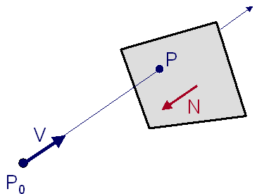
<p style="text-align:center;">
  [Ray-plane intersection](http://www.echo-gaming.eu/ray-to-plane-intersection/)
</p>


```
vec3 interceptPlane( in vec3 source, in vec3 dir, in vec3 normal, float height )
{
  // Compute the distance between the source and the surface, following a ray, then return the intersection
  // http://www.cs.rpi.edu/~cutler/classes/advancedgraphics/S09/lectures/11_ray_tracing.pdf
  float distance = ( - height - dot( normal, source ) ) / dot( normal, dir );
  if( distance < 0.0 )
    return source + dir * distance;
  else
    return - ( vec3( source.x, height, source.z ) + vec3( dir.x, height, dir.z ) * infinite );
}

...

// Compute the ray from camera to world
vec3 ray = getCamRay( cameraRotation, screenUV );

vec3 finalPos = interceptPlane( camPosition, ray, groundNormal, groundHeight );

float distance = length( finalPos );
if( distance > infinite )
  finalPos *= infinite / distance;
```

[Live demo](http://jeremybouny.fr/experiments/screen_space_grid/)

[Full source code](https://github.com/jbouny/projected-grid/blob/master/js/shaders/ScreenSpaceShader.js)


### Tweaking

#### Infinity

A simulated ray can never cross the plane. We need to check if the intersection exists and if it is in front of the camera instead of behind. If the intersection is behind the camera, this can cause some artifacts.

A way could be to remove the vertices, but it can't be done in vertex shader. An other solution is to put it at an "infinite" position following the ray direction. We need to define the notion of inifinity for our application.


<a href="grid_6.jpg">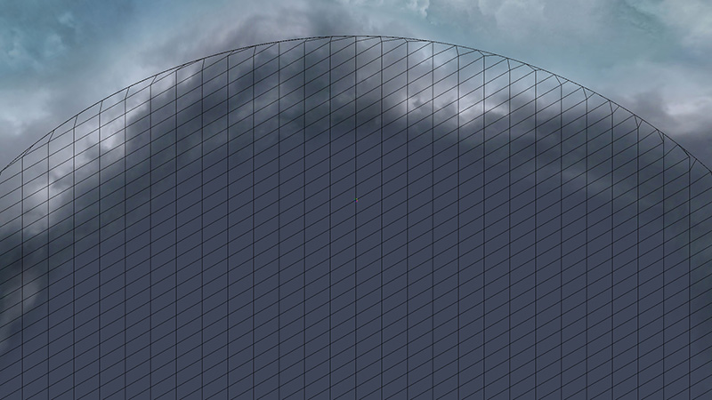</a>
<p style="text-align:center;">
  Infinity setted to 200000, with a grid of 32*32
</p>


#### Displacement map

Once your grid is correctly applied on a plane, you can apply a displacement map for rendering water or terrain.

## Usage example

Here, we have the implementation of an efficient projected grid. There is no need for the developer to manually update data when the camera move, everything is directly extracted from the projection matrix and the view matrix.

The only thing to be done is to generate a grid with right UVs, and to put it in the scene in a way that it is always rendered (on the camera as example).

In order to use it, I give you some resources:

- [Projected grid implementation](https://github.com/jbouny/projected-grid/blob/master/js/shaders/ScreenSpaceShader.js)
- [Live demo](http://jeremybouny.fr/experiments/screen_space_grid/)
- [Source code of the live demo](https://github.com/jbouny/projected-grid)
- [Usage of the shader shunk](https://github.com/jbouny/projected-grid/blob/master/js/shaders/OceanShader.js)
- [A trip under the moonlight: a real use case experiment](https://jbouny.github.io/fft-ocean/)


Vertex shader example:
``` 
vertexShader: [
  'precision highp float;',
  
  'varying vec3 vWorldPosition;',
  'varying vec4 vReflectCoordinates;',

  'uniform mat4 u_mirrorMatrix;',
  
  THREE.ShaderChunk[ "screenplane_pars_vertex" ],
  THREE.ShaderChunk[ "oceanfft_pars_vertex" ],

  'void main (void) {',
    THREE.ShaderChunk[ "screenplane_vertex" ],
    
    'vec4 worldPosition = screenPlaneWorldPosition;',
    
    THREE.ShaderChunk[ "oceanfft_vertex" ],
    
    'vWorldPosition = oceanfftWorldPosition.xyz;',
    'vReflectCoordinates = u_mirrorMatrix * oceanfftWorldPosition;',
    
    'gl_Position = projectionMatrix * viewMatrix * oceanfftWorldPosition;',
  '}'
].join('\n'),
```


<a href="sunset_ocean_fft.jpg">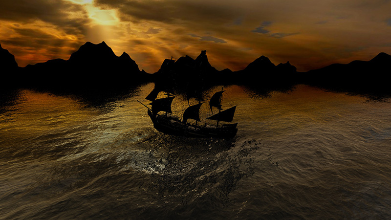</a>
<p style="text-align:center;">
  [A trip under the moonlight](https://jbouny.github.io/fft-ocean/)
</p>


## Resources

Summary of all external resources:

- [Claes Johanson thesis: Real-time water rendering - Introducing the projected grid concept](http://habib.wikidot.com/projected-grid-ocean-shader-full-html-version)
- [Helmut Garstenauer article: Water rendering](http://www.digitalrune.com/Support/Blog/tabid/719/EntryId/210/Water-Rendering.aspx)
- [Chua Hock-Chuan teaching notes: 3D Graphics with OpenGL](http://www.ntu.edu.sg/home/ehchua/programming/opengl/cg_basicstheory.html)
- [openMVG documentation: Pinhole camera model](https://openmvg.readthedocs.org/en/latest/openMVG/cameras/cameras/)
- [Barb Cutler lecture: Ray Tracing](http://www.cs.rpi.edu/~cutler/classes/advancedgraphics/S09/lectures/11_ray_tracing.pdf)
- [Eric Lengyel GDC Keynote: Projection Matrix Tricks](http://www.cs.rpi.edu/~cutler/classes/advancedgraphics/S09/lectures/11_ray_tracing.pdf)

Summary of resources around this implementation:

- [Projected grid implementation](https://github.com/jbouny/projected-grid/blob/master/js/shaders/ScreenSpaceShader.js)
- [Live demo](http://jeremybouny.fr/experiments/screen_space_grid/)
- [Source code of the live demo](https://github.com/jbouny/projected-grid)
- [Usage of the shader shunk](https://github.com/jbouny/projected-grid/blob/master/js/shaders/OceanShader.js)
- [A trip under the moonlight: a real use case experiment](https://jbouny.github.io/fft-ocean/)


